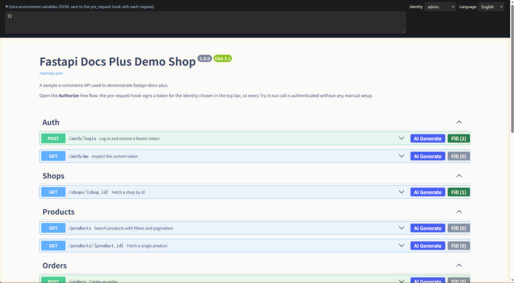

# fastapi-docs-plus

[](https://pypi.org/project/fastapi-docs-plus/)
[](https://pypi.org/project/fastapi-docs-plus/)
[](https://github.com/left666/fastapi-docs-plus/blob/main/LICENSE)

Enhanced interactive API docs for FastAPI that add two capabilities essential for integration and debugging:

- **AI parameter filling** — one click per operation to call an LLM and generate realistic request data that respects the JSON Schema, then write it directly into the Try-it-out form fields.
- **Python-side pre-request hooks** — server-side Python functions that intercept every Swagger UI request to inject authentication, signatures, or dynamic headers (JWT tokens, tenant IDs, CSRF tokens, etc.) using your project's own code.

It replaces FastAPI's built-in `/docs` while keeping Swagger UI as the rendering engine — no fork, no custom frontend build.



---

## Installation

```bash
pip install fastapi-docs-plus
```

Requires Python 3.10 or later.

---

## Quick start

```python
from fastapi import FastAPI
from fastapi_docs_plus import DocsPlusConfig, PreRequestContext, setup_docs_plus

# Turn off the built-in docs, otherwise FastAPI's own /docs route takes
# precedence and this library can never serve the page.
app = FastAPI(docs_url=None)

# ... your routes ...

# Register the enhanced docs. Do this in development only: the pre-request
# hooks run with server-side privileges and the AI endpoints spend your quota.
docs = setup_docs_plus(app, DocsPlusConfig(identities=["admin", "shop_owner"]))

# Optional — give every request a freshly signed token.
@docs.pre_request
async def inject_auth(ctx: PreRequestContext) -> None:
    if ctx.route_path == "/auth/login":  # login issues its own token
        return
    username = ctx.identity or "admin"
    token = create_token(username)  # reuse your project's own signing code
    ctx.headers["Authorization"] = f"Bearer {token}"
```

Start the app with an LLM key to enable the AI buttons:

```bash
DOCS_PLUS_LLM_API_KEY=sk-xxx uvicorn app.main:app --reload
```

Then open `http://127.0.0.1:8000/docs`. Compared with the stock docs you now get:

- a **Generate** button on every operation, which asks the LLM for realistic parameters and caches the validated result;
- a **Fill** button that writes the next cached result straight into the form;
- an identity dropdown (populated from `identities`), whose selection reaches your hook as `ctx.identity`.

Without `DOCS_PLUS_LLM_API_KEY` everything still works — the AI buttons are simply not rendered.

---

## Pre-request hooks

### Registration

```python
@docs.pre_request
def sync_hook(ctx: PreRequestContext) -> None: ...

@docs.pre_request
async def async_hook(ctx: PreRequestContext) -> None: ...
```

Both synchronous and asynchronous callables are supported. Multiple hooks run in registration order and share the same `PreRequestContext`.

### How it works

Before Swagger UI sends any request, the browser POSTs the pending request metadata to `{api_prefix}/api/pre-request`. The hooks execute server-side and return header / query patches. The browser then applies those patches and sends the real request.

- Hooks have full access to your project: databases, signing functions, HTTP clients.
- Protected `openapi.json` URLs work correctly (the pre-request call has no method; the server falls back to `GET`).
- Injected headers appear in the Swagger UI cURL display.

### PreRequestContext

| Field | Type | Description |
|---|---|---|
| `method` | `str` | Uppercase HTTP method |
| `url` | `str` | Full request URL |
| `path` | `str` | URL path component |
| `headers` | `dict[str, str]` | **Mutable**. Sent back as the complete set — deleting a key removes the header |
| `query` | `dict[str, str]` | **Mutable**. URL-decoded; re-encoded on return |
| `env` | `dict[str, Any]` | Environment from the frontend: identity selection + extra env JSON |
| `identity` | `str \| None` | Shorthand for `env["identity"]` |
| `route_path` | `str \| None` | Matched route template, e.g. `/shops/{shop_id}` |
| `operation_id` | `str \| None` | The route's `operation_id`, or the endpoint function name |
| `path_params` | `dict[str, Any]` | Path parameters extracted from the URL |

`route_path`, `operation_id`, and `path_params` are resolved server-side by matching the method and path against `app.routes`, independent of frontend input.

### Headers injected by hooks

Declare hook-injected headers with `include_in_schema=False` so Swagger UI does not require them in the form:

```python
from typing import Annotated
from fastapi import Header

tenant_id: Annotated[str | None, Header(alias="X-Tenant-Id", include_in_schema=False)] = None
```

### Identity switching and extra environment

- `DocsPlusConfig(identities=[...])` controls the top-bar dropdown. The selected value is passed to hooks as `env["identity"]`.
- The **extra environment variables** textarea accepts a JSON object that is merged into `env`, useful for flags like `{"tenant": "...", "debug": true}`.
- Both are persisted in `localStorage` across page refreshes.

---

## AI parameter filling

### Workflow

Split into two separate actions:

1. **Generate** — calls the LLM and caches validated results (does not modify the form).
2. **Fill** — writes the next cached result into the form fields.

**Generate** → `POST {api_prefix}/api/ai/generate`:

1. Extracts the operation from `app.openapi()`, inlines all `$ref` pointers, truncates circular references and levels beyond `max_schema_depth`.
2. Preserves `description`, `enum`, `pattern`, `format`, `minimum`/`maximum`, `examples` as the only signals the LLM receives about real-world semantics.
3. Appends any previously cached results for the same operation so the model avoids duplicates; temperature scales up with history count.
4. Calls the LLM (OpenAI-compatible API, JSON mode) to produce a fixed envelope:
   ```json
   { "path": {}, "query": {}, "header": {}, "cookie": {}, "body": null }
   ```
5. Strips parameters the model invented that are not declared in the schema; forces `body` to `null` when the operation has no `requestBody`.
6. Validates `body` against `jsonschema`. On failure, feeds the validation error back to the model for one retry. **Only validated results enter the cache.**

The cache is a per-operation in-memory queue (`ai_cache_max_size`, default 5). Oldest entries are evicted first. When the schema changes, the cache for that operation is invalidated automatically.

**Fill** → `POST {api_prefix}/api/ai/fill`:

Returns the next result in round-robin order. The frontend expands the operation and writes path/query/header/cookie/body values into the form. Returns 409 when the cache is empty.

### Business hints

Add an `x-ai-hint` extension to your route for domain-specific guidance:

```python
@router.post(
    "/orders",
    openapi_extra={"x-ai-hint": "E-commerce order; use realistic province/city names; unit price 100-2000 CNY"},
)
```

The hint is sent to the LLM as `businessHint`.

### Model configuration

Supports any OpenAI-compatible service (OpenAI, DeepSeek, Tongyi Qianwen, Ollama, etc.).

| Environment variable | `DocsPlusConfig` field | Default |
|---|---|---|
| `DOCS_PLUS_LLM_API_KEY` or `OPENAI_API_KEY` | `llm_api_key` | (none) |
| `DOCS_PLUS_LLM_BASE_URL` or `OPENAI_BASE_URL` | `llm_base_url` | OpenAI official |
| `DOCS_PLUS_LLM_MODEL` | `llm_model` | `gpt-4o-mini` |

When no API key is configured, the AI buttons are not rendered and a notice is shown in the toolbar. The rest of the documentation works normally.

---

## Configuration

### DocsPlusConfig

| Field | Default | Description |
|---|---|---|
| `docs_url` | `"/docs"` | Documentation page path |
| `api_prefix` | `"/_docs"` | Prefix for internal endpoints and static assets |
| `openapi_url` | `"/openapi.json"` | URL for the OpenAPI spec |
| `swagger_ui_version` | `"5.17.14"` | Swagger UI version for CDN URLs |
| `swagger_ui_js_url` | `None` | Override the JS bundle URL |
| `swagger_ui_css_url` | `None` | Override the CSS URL |
| `swagger_ui_js_integrity` | `None` | SRI hash for the JS bundle |
| `swagger_ui_css_integrity` | `None` | SRI hash for the CSS |
| `swagger_ui_parameters` | see below | Extra `SwaggerUIBundle` options; merged key-wise over the defaults, so you only need to pass the keys you want to change |
| `identities` | `[]` | Identity dropdown options; empty hides the dropdown |
| `llm_model` | `"gpt-4o-mini"` | LLM model name |
| `llm_base_url` | `None` | API base URL (reads `DOCS_PLUS_LLM_BASE_URL` / `OPENAI_BASE_URL`) |
| `llm_api_key` | `None` | API key (reads `DOCS_PLUS_LLM_API_KEY` / `OPENAI_API_KEY`) |
| `llm_temperature` | `0.3` | LLM temperature; +0.1 per history item, capped at 1.0 |
| `llm_timeout` | `60.0` | Per-call timeout in seconds |
| `max_schema_depth` | `4` | Maximum `$ref` inlining depth |
| `max_schema_chars` | `60000` | Max characters for schema + history; beyond this the request is rejected |
| `ai_cache_max_size` | `5` | Max cached results per operation; oldest evicted first |

Default `swagger_ui_parameters`:

```python
{
    "persistAuthorization": True,
    "displayRequestDuration": True,
    "docExpansion": "list",
    "showExtensions": True,
    "showCommonExtensions": True,
}
```

User-supplied values are merged **key-wise** over these defaults, so you only need to pass the keys you want to change; the remaining keys keep their default values.

### HTTP endpoints

All are excluded from the OpenAPI document.

| Method | Path | Purpose |
|---|---|---|
| GET | `{docs_url}` | Documentation HTML page |
| GET | `{api_prefix}/static/*` | Frontend static assets |
| POST | `{api_prefix}/api/ai/generate` | Generate and cache validated AI parameters |
| POST | `{api_prefix}/api/ai/fill` | Retrieve next cached result (409 if empty) |
| GET | `{api_prefix}/api/ai/cache` | Read cache counts for all operations |
| POST | `{api_prefix}/api/pre-request` | Execute pre-request hooks and return patches |

---

## Limitations

- **Development use only.** Pre-request hooks issue server-side credentials and AI calls consume tokens. Do not register enhanced docs in production.
- **`static/adapter.js` is the sole bridge to Swagger UI internals.** Upgrading `swagger_ui_version` requires regression testing of parameter and body filling. Two known pitfalls (already handled in the adapter):
  - Parameter values use `${in}.${name}.hash-${param.hashCode()}` as storage keys; the hash comes from the **raw** parameter object. Objects from `operationWithMeta()` carry `value`/`errors` and produce a different hash, causing writes to land on keys nobody reads.
  - When an operation is collapsed the `RequestBody` component is not mounted; on mount it overwrites values with auto-generated examples. The fill flow expands the operation first.
- **AI cache is in-process memory.** Per-operation queue, lost on restart. Multi-worker processes have independent caches — badge counts and round-robin order may be inconsistent across workers.
- **Complex parameter type support.** Scalars, enums, and arrays use native form controls. Deeply nested object-type query parameters are serialised as JSON strings and may not match the target API's deserialisation convention. Request bodies (JSON) are not affected.